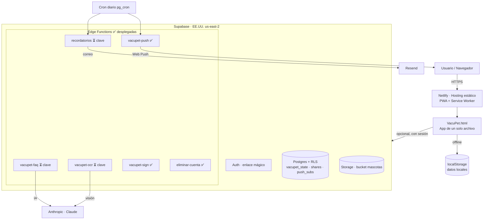

# VacuPet — Presentación de Avance

_Fecha: 2026-06-15 · Versión del documento: 1.0_
_App en producción: **https://vacupet-app.netlify.app**_

> **VacuPet** es un carné de salud digital para mascotas (PWA de un solo archivo):
> perfiles, vacunas, desparasitación, cuidados, peso, visitas, recordatorios, asistente
> con IA, exportación (PDF / CSV / QR de integridad) y nube opcional.
> Registro personal de apoyo — **no reemplaza el carné oficial ni la consulta veterinaria.**

---

## 1. Resumen ejecutivo

VacuPet está **publicada, operativa y con backend conectado**. La app está terminada; la
**nube ya funciona** (cuentas, sincronización, fotos en Storage, firma del QR, recordatorios
programados). Lo único pendiente para el 100% es **activar la IA** (clave de Anthropic) y el
**email** (clave de Resend / SMTP propio), más cerrar la revisión legal.

| Indicador | Estado |
|-----------|--------|
| App (frontend) | ✅ ~100% — terminada y desplegada |
| Infraestructura en la nube | ✅ **Conectada y operativa** (DB, auth, storage, sync, cron) |
| Edge Functions | ✅ **6 desplegadas** |
| Firma del QR (VAPID/ES256) | ✅ Activa y verificada |
| Asistente FAQ | ✅ **LLM local en el navegador** (WebLLM) — privado, sin clave |
| Escaneo OCR del carné | ⏳ Falta `ANTHROPIC_API_KEY` (solo OCR usa la nube) |
| Email de recordatorios | ⏳ Falta `RESEND_API_KEY` |
| Login por email | 🟡 Funciona (enlace mágico); SMTP propio recomendado para fiabilidad |
| Documentación legal | 🟡 Borrador — pendiente revisión de abogado |
| Publicación / hosting | ✅ En línea con HTTPS (Netlify) |

---

## 2. Estado por área (avance %)

| Área | Avance | Nota |
|------|:------:|------|
| Diseño e interfaz (UI/UX) | 100% | Minimal premium, modo oscuro, héroe con foto, micro-interacciones |
| Pantalla de inicio (dashboard) | 100% | Héroe, estado del día, chips, banner de próxima, carrusel |
| Reorganización IA "Salud unificada" | 100% | Un lugar por dominio: Inicio · Salud · Mascota · Más |
| Multi-idioma (ES/EN/PT) | 95% | Chrome y pantallas; fichas español-primero |
| Esquema por especie | 100% | Próxima dosis, refuerzos, puesta al día (perro/gato/genérico) |
| Salud (vacunas, desp., cuidados, peso, visitas) | 100% | Con edición de registros y gráfico de peso |
| Exportación (PDF / CSV / QR firmado) | 100% | QR de integridad activo en producción |
| Privacidad y seguridad | 100% | PIN/biométrico, respaldo cifrado, borrar cuenta |
| Viajero / veterinarias / logros | 100% | 5 destinos, geolocalización, gamificación |
| Álbum y documentos | 100% | Galería + adjuntos (a Storage con sesión) |
| Asistente IA (chat híbrido) | 90% | Motor offline ✅; FAQ Claude por activar (clave) |
| Escaneo OCR del carné | 90% | UI + función desplegada; falta clave de IA |
| Recordatorios push | 100% | VAPID + suscripción + función + **cron programado** |
| Recordatorios email | 90% | Función + cron listos; falta clave de Resend |
| Infraestructura nube | 100% | DB+RLS, auth, Storage, 6 funciones, cron — **conectado** |
| Documentación legal | 70% | Borrador completo; pendiente abogado |
| Publicación | 100% | En línea (Netlify, HTTPS, PWA) |

---

## 3. Funcionalidades aplicadas (detalle)

### Experiencia de usuario
- Sistema de diseño **minimal premium** (estilo Apple Health), tipografía Inter, **modo oscuro**.
- **Héroe con foto** de la mascota en el inicio, con anillo de progreso animado y estado del día.
- **Personalización**: 6 colores de acento en vivo + color por especie + estados vacíos cuidados.
- **Micro-interacciones**: confeti al desbloquear logros, **View Transitions** entre pestañas.
- **Accesibilidad**: texto grande, respeto a `prefers-reduced-motion`, roles ARIA, foco visible.
- **Mascota de ejemplo** ("Ver ejemplo" / enlace `#demo`) para explorar sin teclear.

### Salud de la mascota (núcleo)
- **Perfiles multimascota**: especie (perro/gato/conejo/hurón/ave/otro), raza, sexo, nacimiento,
  microchip, esterilización, color, foto, veterinario.
- **Vacunas, desparasitación (interna/externa), cuidados** (baño, uñas, medicación, peluquería,
  cumpleaños), **peso** (con gráfico de evolución) y **visitas al veterinario**.
- **Editar cualquier registro** (no solo añadir/borrar).
- **Esquema por especie** con sugerencia de próxima dosis; orientado a Guatemala (rabia anual),
  con nombres comerciales comunes como sugerencia. Etiquetado "orientativo, validar con vet".
- **Fichas por vacuna/enfermedad** (qué previene, para quién, efectos típicos).

### Recordatorios
- **Locales**: chips/banner de próximas y vencidas, ventana configurable, exportar **.ics**.
- **Servidor**: **Web Push** (VAPID) y **email** (Resend), con **cron diario** ya programado
  (push 07:00 / email 07:05 hora de Guatemala) y antiduplicado.

### Inteligencia artificial (híbrida)
- **Motor de reglas offline** (sin enviar datos): "¿qué le falta?", "próxima dosis", "próxima
  desparasitación", "registrar por chat", "explica el recomendador".
- **Asistente FAQ veterinaria con LLM LOCAL** (WebLLM en el navegador): las preguntas **no
  salen del dispositivo**, sin API key ni costo. Descarga el modelo una vez (con consentimiento)
  y requiere WebGPU (Chrome/Edge); si no, deriva al veterinario.
- **Escaneo de carné con IA (OCR)** + pantalla de **revisión obligatoria** _(usa Claude; la foto
  se envía con consentimiento — falta clave de Anthropic)._
- Consentimiento de IA **explícito** (descarga del modelo local / envío de la foto al OCR).

### Exportación y verificación
- **PDF clínico veterinario** (datos de la mascota + tablas de vacunas/desparasitación/peso/visitas).
- **CSV** (registro legible por clínicas / hojas de cálculo).
- **QR de integridad firmado** (ES256 / ECDSA P-256) + verificación "✓ verificada / ⚠ alterada".

### Privacidad y seguridad
- **Bloqueo con PIN** (PBKDF2) + **biométrico** (WebAuthn).
- **Respaldo cifrado** (AES-GCM + PBKDF2) con contraseña.
- **Centro de privacidad**: bloqueo, respaldo, borrar datos locales, **eliminar cuenta** (nube).

### Nube (opcional)
- **Cuentas** por email (**enlace mágico**) y **sincronización** entre dispositivos (con
  resolución de conflictos por fecha).
- **Compartir carné** por enlace/QR de solo lectura (con token que caduca si hay sesión).
- **Fotos y documentos** en **bucket privado** de Supabase Storage con **enlaces firmados** temporales.
- **Eliminar cuenta y datos** (derecho de supresión) vía Edge Function.

### Extras
- **Modo viajero** (requisitos por destino contrastados con el carné), **veterinarias cercanas**
  (geolocalización) y **logros** (gamificación).

---

## 4. Arquitectura técnica

**Resumen en texto** (si el diagrama no renderiza):
`Usuario → Netlify (PWA) → App (1 archivo HTML)`; datos en `localStorage` (offline) y, con
sesión, en **Supabase** (Auth por enlace mágico + Postgres con RLS + Storage privado + 6 Edge
Functions). Un **cron diario** dispara los recordatorios push/email. Las funciones de IA
conectan con **Anthropic (Claude)** (faltan claves), el email con **Resend** (falta clave).

### Stack
| Capa | Tecnología |
|------|-----------|
| Frontend | HTML/CSS/JS en un solo archivo (PWA, offline, localStorage) |
| Hosting | Netlify (HTTPS, build a carpeta limpia `dist/`) |
| Backend | Supabase (Postgres + RLS, Auth, Storage, Edge Functions en Deno) |
| IA | Anthropic Claude (FAQ y OCR de visión) — pendiente de clave |
| Correo | Resend — pendiente de clave |
| Notificaciones | Web Push (VAPID) + cron (pg_cron) |
| Seguridad | ECDSA P-256 (firma QR), AES-GCM (respaldo), WebAuthn (biométrico), RLS |
| Calidad | Suite de tests (`node tests/run.mjs`) — 79 pruebas |

---

## 5. Cumplimiento legal (estado)

> Detalle completo y dossier para el abogado en [`REVISION_LEGAL.md`](REVISION_LEGAL.md).

> **Diferencia clave vs. apps de salud humana:** VacuPet trata datos de **mascotas**, que **no
> son datos personales de salud de categoría especial** ni de **menores**. El dato personal
> principal es el **correo del dueño** (cuenta). Esto reduce mucho la carga legal — pero el
> tratamiento de la cuenta, las fotos y el envío a IA siguen requiriendo aviso y consentimiento.

| Estado | Puntos |
|--------|--------|
| ✅ Aplicado | Terceros declarables (Supabase, Resend, Anthropic, Netlify) · descargo "no reemplaza al veterinario" · nube opcional con consentimiento · almacenamiento local sin cookies de rastreo · enlaces de compartir que caducan · eliminar cuenta y datos |
| 🟡 Provisional | Contacto (`luis@gomezgt.com`) · jurisdicción (Guatemala) — marcados para validación |
| 🔴 Pendiente (abogado) | Responsable formal · transferencia internacional (EE.UU.) · consentimiento de IA · plazos de conservación · DPA con proveedores · términos finales |

Documentos: [`PRIVACIDAD.md`](PRIVACIDAD.md), [`TERMINOS.md`](TERMINOS.md) (borradores).

---

## 6. Métricas del producto

| Métrica | Valor |
|---------|------|
| Especies soportadas | 6 (perro, gato, conejo, hurón, ave, otro) |
| Fichas de vacuna | ~9 (perro/gato/genérico) |
| Tipos de cuidado | 6 (baño, uñas, medicación, peluquería, cumpleaños, otro) |
| Destinos del modo viajero | 5 |
| Idiomas | 3 (ES / EN / PT) |
| Colores de acento | 6 |
| Formatos de exportación | 3 (PDF, CSV, QR firmado) |
| Edge Functions desplegadas | 6 |
| Pruebas automatizadas | 79 (todas en verde) |
| Funciona offline | Sí (PWA instalable) |
| Costo de infraestructura base | Planes gratuitos (Supabase / Netlify) |

---

## 7. Roadmap

### Inmediato (para llegar al 100% funcional)
1. **Activar IA** → `ANTHROPIC_API_KEY` (asistente FAQ + OCR).
2. **Activar email** → `RESEND_API_KEY` + (recomendado) **SMTP propio** para login fiable.
3. **Revisión legal** con abogado (cerrar puntos 🔴) y rellenar responsable/contacto.
4. Verificación end-to-end (login → sync entre 2 dispositivos → push → email).

### Calidad / crecimiento
- Esquema vacunal validado por veterinario del país objetivo.
- Multi-cuidador (compartir edición con la familia).
- Dominio propio + monitoreo de errores.
- Campañas/recordatorios estacionales.

---

## 8. Diferenciadores

- **Privacidad primero**: funciona 100% offline; la nube es opcional y con consentimiento.
- **Carga legal ligera**: datos de mascotas (no salud humana ni menores).
- **Integridad verificable**: QR firmado criptográficamente (no es un certificado oficial).
- **Completo**: salud, cuidados, peso, álbum, documentos, viajero, asistente — en un solo lugar.
- **Multiplataforma**: PWA instalable en móvil y escritorio, sin tiendas de apps.
- **IA con consentimiento**: asistente y OCR opcionales y transparentes.

---

_Documento de presentación de avance. Estado técnico detallado en
[`ROADMAP.md`](ROADMAP.md); especificación en [`SPEC.md`](SPEC.md); despliegue en
[`DESPLIEGUE.md`](DESPLIEGUE.md) y [`ACTIVAR_SERVICIOS.md`](ACTIVAR_SERVICIOS.md)._
